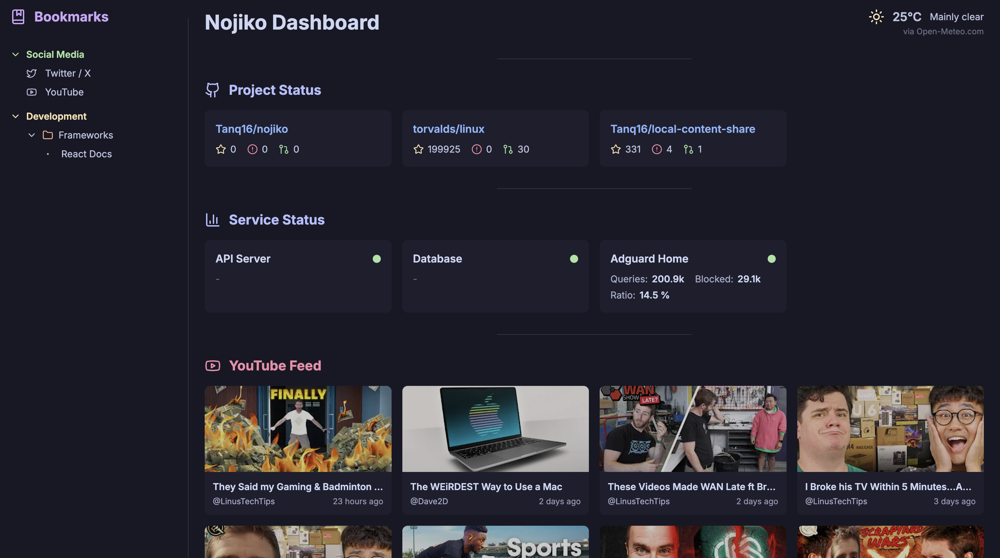

<div align="center">


<h1>Nojiko Self-Hosted Dashboard</h1>

[](https://github.com/tanq16/nojiko/actions/workflows/release.yml)
[](https://github.com/Tanq16/nojiko/releases/latest)

A simple, beautiful, and customizable dashboard for your self-hosted domain. Nojiko focuses on simple status and feed trackers, with a comprehensive bookmarks system to be used as the primary webpage across all devices.

<a href="#features">Features</a> &bull; <a href="#installation">Installation</a> &bull; <a href="#usage">Usage</a> &bull; <a href="ai-development">AI-Development</a>

</div>

---

`Quickstart` &rarr;

```bash
docker run --rm -v "$HOME/nojiko:/app" -p 80:8080 --name "nojiko" -d tanq16/nojiko:main
# $HOME/nojiko should contain the config.yaml file
```

## Features

Work in progress

Nojiko focuses on simplicity in a dashboard application. It offers 4 main sections on the screen:
- Header - this shows a logo (optional) and title of your choice, along with optional weather given your location
- Bookmarks - this is a sidebar that shows your bookmarks with your choice of names and icons across your choice of categories and folders within categories (both foldable)
- Status Cards - these are the first set of cards on the main screen, currently 2 types of sections are supported - github repo status (shows PRs, issues, and stars), and service status (stats from other homelab services)
- Feed Cards - this is the next set of cards that shows youtube videos with thumbnails for your configured creators

> [!WARNING]
> Currently, only Adguard Home and Jellyfin are supported for services. Additionally, only Youtube feeds are supported. RSS feeds will be added in the future.

> [!IMPORTANT]
> All configuration of the dashboard is done via a `config.yaml` file. You can choose your icons, but they need to be part of [lucide](https://lucide.dev/icons/).

Here's a screenshot of what the app looks like:



## Installation

Create a directory to store the configuration file:

```bash
mkdir $HOME/nojiko
```

Create a config.yaml file similar to the `config.yaml.example` provided in the repo. Add the necessary details (read the Usage section below for more). With the config ready, use the following compose yaml to deploy the app:

```yaml
services:
  nojiko:
    image: tanq16/nojiko:main
    container_name: nojiko
    volumes:
      - /home/USER/nojiko:/app # this is the dir that has your config
    ports:
      - 8080:8080
```

The application with run at your `machineIP:8080`. Allow a few seconds for the first data fetch to complete before the server is enabled.

## Usage

Work in progress

## AI-Development

This is my first project that I completely vibe-coded. Vibe coded also means various things - the description I mean is the fact that I control implementation and tell AI what to do, not a simplistic variant of "hey AI, write me a dashboard application that has bookmarks". I described the entirety of the vibe code process I took for this project below, so feel free to expand and read.

<details>
<summary>Previous experience with vibe-coding vs. this one</summary>
Usually, I use AI autocomplete for quick writing and also to quicly build and iterate on UI configurations. I've been pretty successful at increasing productivity quite a bit this way. However, I've never had good luck with fully vibe coding (i.e., minimal intervention into code) the self-hosted apps I was writing - AI used to either overcomplicate, misunderstand, or competely botch the implementation.

So what's different with this one? After a bunch of experimentation, I finally landed on proper instructions to prompt the model to restrict its creativity. By that, I mean, I explicitly stated each and every thing I wanted to be present in the code including formats and structs, thereby leaving little room for the model to deviate from what I want. Additionally, I explicitly stated a large number of rules for it to follow for the implementation, which I had previously seen it go off on its own. Example, I've seen the model use arbitrary third party libraries for various things, add an extraneous amounts of comments unnecessarily, and implement it as if it were the backend implementation of Google, not a simple self-hosted app I wanted to write and use.

The result was actually really good! And it became a very quick way to iterate on the implementation. Design was always fast to iterate on anyway (hint: AI models are actually really good with UI stuff). It took a LOT of prompting. To quantify, around a total of around 6-7 hours of just writing English text describing everything I wanted in code and design. BUT, by restricting the model to do exactly what I wanted and leave little wiggle room, I was actually able to get the result I wanted, which I would have gotten to myself if I was actively writing code.
</details>

<details>
<summary>Vibe Code Process for this Project</summary>
Broadly speaking, I can divide the process I followed into 3 phases in order:

- Frontend Design: Why frontend first? It's hard for me to do frontend work, writing backend, specially for simple apps is much easier significantly. so even if I have no aid on the backend, it's totally manageable and fast as long as I quickly get a UI rolling.
- Backend Design: This is where I can completely imagine and write whatever is needed. So describing stuff is really easy in plain english. The only thing was to get the model to do it "my way".
- Iterations: Once the app is in place and the model does things the way I want, iterations to add features or fix things become trivial.

One quick cheatcode I discovered about the UI. Using a pre-existing color palette along with Tailwind and a prompt asking the AI to not use any CSS that needs to be managed, actually yields incredible results. After that it's just a question of tweaking.

My overall process step-wise was this:
- I had a general idea of the design I wanted. So I created a mockup on my iPad. By mockup, I mean hand-drawn boxes that I ideated on. I just gave that straight to the model. This took some time to get right, but eventually got there.
- Next thing I did (very important), looked at the frontend pieces to remove ambiguity and unnecessary complications. This required reading code and giving specifics to the model.
- With a plain single HTML file ready, I was free to ideate on the backend. I wrote down a large amount of prompt text indicating basic structs and interfaces I wanted to use, including the libraries I wanted to use and the overall idea I wanted to implement. As an example, this included the basic design and idea behind the state.go file, which I wanted to be the logic for maintaining a state that the frontend would receive and display.
- With the mock implementations ready, I was able to go deeper down into specifics and prompt my way through individual implementations like getting statuses from GitHub repos.
- Certain things became extremely easy due to AI, the primary one being fetching information for YouTube videos, which would have taken a while for me to do myself.
- At this point, iterations became simple with shorter prompts to add things. I, however, still followed the initial method of laying down the exact implementation of things I wanted to ensure the model doesn't do random things.

Overall, I also maintained a strategy to do two things:
- Every single primary prompt would be a large and structured piece of text aiming to do anywhere between 3-4 different things; and each prompt would represent one single chat only.
- Before switching to the new chat for the next big prompt, I also did a quick once over across the code base to ensure everything follows my vision and style.

With all this, honestly, I was able to get to a working sample with <24 hours of monitored vibe-coding. With only frontend being assisted by AI, I would expect this time to jump to over 1 week. And if I was to do it all myself, around 1 month LOL. Super happy with this fully vibe-coded project.
</details>
